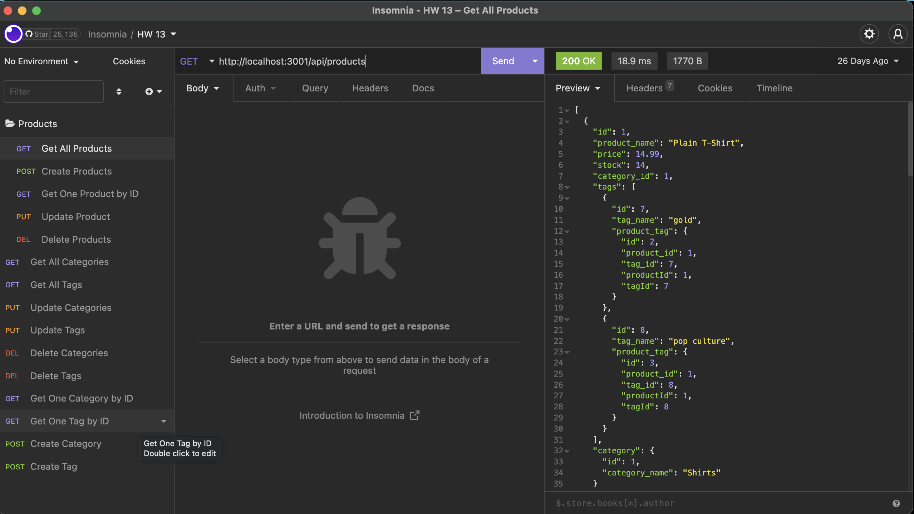

# Ecommerce Back End-ORM

## Description

Using ORM update and edit the backend of your ecommerce storefront. 

## Usage

Run post, pull, and delete on insomnia to test the routes and update the store front. 

## Credits

Emilee Bogdan  
GitHub: emileebogdan  
Email: emileebogdan@gmail.com  
